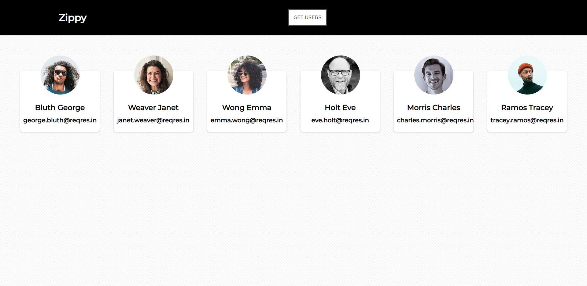

# LGMVIP-WebDev

Task 1 -
In this task I made a single page site using HTML , CSS & JAVASCRIPT
to see the page visit : https://divyanshuverma08.github.io/LGMVIP-WebDev/Task%201/

Task 2 -
In this task I made a React App having custom NavBar and Card.
I make use of fetch method to get the data.

I didn't uploaded the node modules. To run react app fork this repository and install dependencies

Below is pic of my react app:

